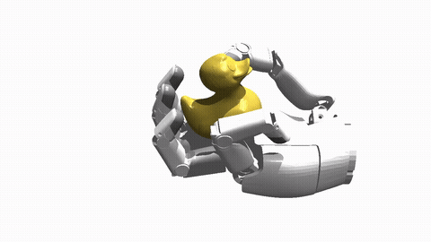
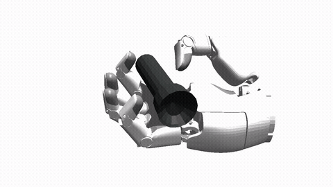
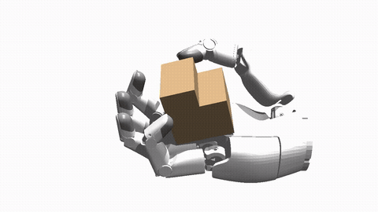
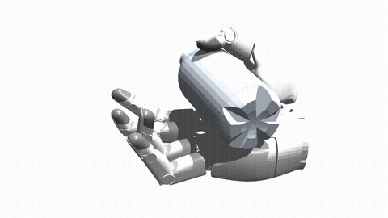
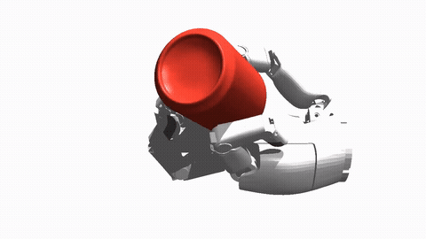
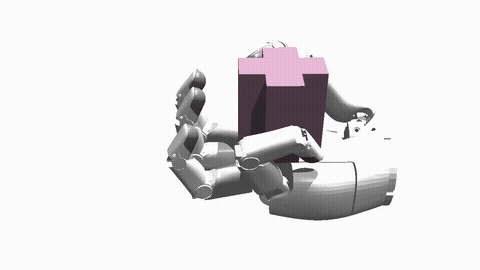
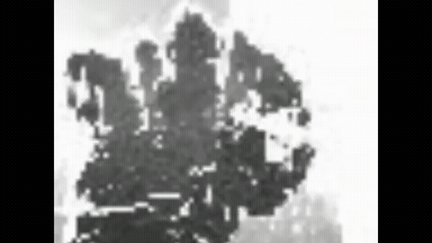
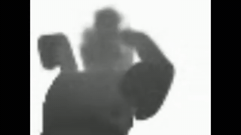

# WM-Craftnet: World Synesthesia Model for Generalizable and Robust Dexterous In-Hand Manipulation

**Jie Yin** · **Zeyuan Zhao** · **Xiaojing Tan** · **Yang Liu** · **Chiyu Wang** · **Xinyang Gu**

Sharpa Robotics · Conference on Robot Learning (CoRL) 2026

[](https://wmcraftnet.github.io)
[](https://arxiv.org/abs/2609.07002)
[](https://huggingface.co/SharpaIT/WM-Craftnet)
[](https://www.corl.org/)
[](LICENSE)
[](https://www.sharpa.com/pages/wave)
[](https://developer.nvidia.com/isaac-gym)

<p align="center">
  <a href="https://wmcraftnet.github.io">
    
  </a>
</p>

## Overview

WM-Craftnet learns a **World Synesthesia Model (WSM)** for dexterous in-hand rotation. It fuses proprioception, noisy wrist depth, tactile contact, and action history into an action-conditioned recurrent state that captures geometry, contact, motion, and slip. That state is passed directly to an asymmetric actor–critic policy as a deployable representation—without imagined rollouts.

The model also reconstructs clean depth from noisy observations, which improves sim-to-real transfer to the human-sized, five-finger, 22-DoF [Sharpa Wave](https://www.sharpa.com/pages/wave) hand.


## Highlights

| | |
| --- | --- |
| **Predictive visuotactile state** | Fuses proprioception, depth, touch, and action history while denoising hand–object geometry. |
| **Robust, generalizable control** | Handles multiple objects, unseen geometries, pose shifts, drift, and external disturbances. |
| **Reusable physical prior** | A WSM pretrained on nine z-axis objects can initialize learning on other object sets. |
| **Real-robot deployment** | Transfers to Sharpa Wave using deployable wrist depth and tactile sensors. |

## Method

1. **Encode** proprioception, wrist depth, tactile contact, and the previous action.
2. **Predict** action-conditioned dynamics with a Dreamer-style recurrent state-space model, supervised by clean depth and reward.
3. **Control** with the detached deterministic WSM state fed to the policy; reuse pretrained WSM weights for new object sets.

## Demos

<table>
  <tr>
    <td valign="top" width="33%">
      
      <br/>
      <b>Duck</b> · z-axis
      <br/>
      Stable finger contacts on a curved, asymmetric object during continuous z-axis rotation.
    </td>
    <td valign="top" width="33%">
      
      <br/>
      <b>Flashlight</b> · y-axis
      <br/>
      Target-axis rotation of an elongated body about its shorter axis under larger moment arms.
    </td>
    <td valign="top" width="33%">
      
      <br/>
      <b>Stepped block</b> · x-axis
      <br/>
      Rolling and fingertip-contact reallocation for gravity-sensitive x-axis rotation.
    </td>
  </tr>
  <tr>
    <td valign="top" width="33%">
      
      <br/>
      <b>Bottle</b> · thumb-guided re-centering
      <br/>
      0–10 s: thumb draws the bottle toward the fingers, then y-axis rotation continues.
    </td>
    <td valign="top" width="33%">
      
      <br/>
      <b>Coke Can</b> · five-finger stabilization
      <br/>
      0–5 s: all five fingers upright the can from a poor start, then z-axis rotation resumes.
    </td>
    <td valign="top" width="33%">
      
      <br/>
      <b>Cross block</b> · palm-to-finger transfer
      <br/>
      0–7 s: fingers move the object from the palm onto the fingertips, then z-axis rotation continues.
    </td>
  </tr>
</table>

More real-robot, multi-axis, depth-reconstruction, and unseen-object rollouts are on the [project website](https://wmcraftnet.github.io).

---

## Getting Started

### Installation

**Requirements**

- Linux with an NVIDIA GPU and a compatible CUDA driver
- Python 3.8
- PyTorch 2.1.0 with CUDA 11.8
- NVIDIA Isaac Gym Preview 4

```bash
conda create -n wm-craftnet python=3.8
conda activate wm-craftnet

conda install pytorch=2.1.0 torchvision torchaudio pytorch-cuda=11.8 \
  -c pytorch -c nvidia
conda install -c fvcore -c iopath -c conda-forge fvcore iopath
conda install pytorch3d -c pytorch3d

pip install hydra-core gym numpy==1.22.2 tensorboardX tensorboard \
  wandb scipy imageio imageio-ffmpeg h5py trimesh rtree pillow ninja
```

Download [NVIDIA Isaac Gym Preview 4](https://developer.nvidia.com/isaac-gym), accept its license, then install:

```bash
tar -xzvf IsaacGym_Preview_4_Package.tar.gz
cd isaacgym/python
pip install -e . --no-deps
```

See [`install.md`](install.md) for additional notes.

### Quick test (simulation)

Download the released z-axis checkpoint and run the test script:

```bash
hf download SharpaIT/WM-Craftnet wm_craftnet_set_z.pth --local-dir example_ckpt

CHECKPOINT=example_ckpt/wm_craftnet_set_z.pth \
bash scripts/test_wm_craftnet.sh
```

- Weights: [`wm_craftnet_set_z.pth`](https://huggingface.co/SharpaIT/WM-Craftnet/blob/main/wm_craftnet_set_z.pth) on [`SharpaIT/WM-Craftnet`](https://huggingface.co/SharpaIT/WM-Craftnet)
- Config: [`example_ckpt/wm_craftnet_set_z.yaml`](example_ckpt/wm_craftnet_set_z.yaml)

The script opens the viewer by default. Pass extra Hydra arguments after the script name, or set `HEADLESS=true` when no display is available.

---

## Training

Each entry script selects the matching task config and accepts Hydra overrides:

```bash
# z-axis rotation on nine objects
bash scripts/train_wm_craftnet_z.sh task.env.objSet=set_z

# x-axis rotation on four objects
bash scripts/train_wm_craftnet_x.sh task.env.objSet=set_x4

# y-axis rotation on nine tool-like objects
bash scripts/train_wm_craftnet_y.sh task.env.objSet=set_y
```

**Object sets**

| Set | Objects | Task |
| --- | --- | --- |
| `set_z` | 9 diverse shapes | z-axis rotation; WSM pretraining |
| `set_x4` | 4 contact-constrained shapes | x-axis rotation |
| `set_y` | 9 elongated / tool-like shapes | y-axis rotation |

Object meshes, robot assets, and datasets may have terms outside this repository. See [`THIRD_PARTY_NOTICES.md`](THIRD_PARTY_NOTICES.md) before redistribution.

**Memory settings**

The paper setup uses `num_envs=1024` and `minibatch_size=4096` ([`WMCraftnetPPO.yaml`](isaacgymenvs/cfg/train/WMCraftnetPPO.yaml)). Scripts default to `256` envs and a `1024` minibatch so the WSM replay buffer fits on a 32 GiB host:

```bash
# default (memory-safe)
bash scripts/train_wm_craftnet_y.sh

# lower further if needed
NUM_ENVS=128 MINIBATCH_SIZE=512 bash scripts/train_wm_craftnet_y.sh

# paper settings on larger machines
NUM_ENVS=1024 MINIBATCH_SIZE=4096 bash scripts/train_wm_craftnet_y.sh
```

Edit the device switches at the top of each script for simulation, RL, and graphics GPUs. Outputs go to `runs/`.

### WSM prediction heads

Six optional heads are enabled by default—proprioception, clean depth, object pose, tactile contact, critic value, and BPS object shape—plus reward prediction. Configure them under `task.env.cameraPolicy.worldModel` in [`WMCraftnetRotation.yaml`](isaacgymenvs/cfg/task/WMCraftnetRotation.yaml):

```bash
# legacy setup: proprioception + depth only (matches released checkpoint)
bash scripts/train_wm_craftnet_z.sh \
  task.env.cameraPolicy.worldModel.wm_pose_pred=False \
  task.env.cameraPolicy.worldModel.wm_tac_pred=False \
  task.env.cameraPolicy.worldModel.wm_value_pred=False \
  task.env.cameraPolicy.worldModel.wm_obj_pred=False
```

Checkpoint and head configs must match at train and test time. The released checkpoint uses proprioception + depth; evaluate with `scripts/test_wm_craftnet.sh`. Full-head runs need matching flags (see `scripts/test_wm_craftnet_y.sh`).

---

## Real-Robot Deployment

Hardware examples are under [`deploy/`](deploy/). Use **Python 3.10** for deployment; simulation and training stay on **Python 3.8**.

<table>
  <tr>
    <td align="center" valign="top" width="33%">
      
      <br/>
      <b>Real Z-Axis Duck Rotation</b>
      <br/>
      WM-Craftnet rotates a duck on the Sharpa Wave hand using wrist depth and tactile feedback.
    </td>
    <td align="center" valign="top" width="33%">
      
      <br/>
      <b>Real Noisy Wrist Depth</b>
      <br/>
      Raw depth from the wrist camera during the same rollout—noisy, incomplete, and hard to use directly for control.
    </td>
    <td align="center" valign="top" width="33%">
      
      <br/>
      <b>Real Predicted Depth from WSM Latent</b>
      <br/>
      WSM reconstructs a cleaner depth map that preserves hand–object geometry despite sensor noise.
    </td>
  </tr>
</table>

On real hardware, the wrist depth stream is noisy and incomplete. The WSM latent reconstructs a cleaner depth representation that preserves hand–object geometry—supporting the same policy at deployment time. More rollouts are on the [project website](https://wmcraftnet.github.io/#depth-reconstruction).

### 1. Install Sharpa Wave SDK

Download from the [Sharpa download page](https://www.sharpa.com/pages/downloads) or [GitHub releases](https://github.com/sharpa-robotics/sharpa-wave-sdk/releases). On x86-64 Ubuntu, run from the repository root to install the public non-CUDA SDK v5.0.9 under `deploy/sharpa_sdk/`:

```bash
SDK_DEB=/tmp/sharpa-wave-sdk_5.0.9_amd64.deb
SDK_TMP=$(mktemp -d)

curl -fL \
  https://github.com/sharpa-robotics/sharpa-wave-sdk/releases/download/v5.0.9/sharpa-wave-sdk_5.0.9_amd64.deb \
  -o "$SDK_DEB"
echo "672c0b2e02f64c0db22760e8331f6e35e1fc9e7ef84363e81481e608a1278dfb  $SDK_DEB" \
  | sha256sum -c -
dpkg-deb -x "$SDK_DEB" "$SDK_TMP"

rm -rf deploy/sharpa_sdk/lib deploy/sharpa_sdk/python/sharpa
mkdir -p deploy/sharpa_sdk/python
cp -a "$SDK_TMP/opt/sharpa-wave-sdk/lib" deploy/sharpa_sdk/lib
cp -a "$SDK_TMP/opt/sharpa-wave-sdk/python/sharpa" deploy/sharpa_sdk/python/sharpa
cp "$SDK_TMP/opt/sharpa-wave-sdk/VERSION" deploy/sharpa_sdk/VERSION
cp "$SDK_TMP/opt/sharpa-wave-sdk/sdk-release-info.json" deploy/sharpa_sdk/sdk-release-info.json

rm -rf "$SDK_TMP" "$SDK_DEB"
```

The non-CUDA build receives 30 Hz tactile inference from the hand. The optional CUDA SDK build requires CUDA 13.x and TensorRT 10.x.

### 2. Configure and run

Download [`wm_craftnet_set_z.pth`](https://huggingface.co/SharpaIT/WM-Craftnet/blob/main/wm_craftnet_set_z.pth) into `example_ckpt/` with sibling [`example_ckpt/wm_craftnet_set_z.yaml`](example_ckpt/wm_craftnet_set_z.yaml). Set `checkpoint`, camera options, `no_actuation`, and `max_steps` in `build_hardcoded_config()` inside [`deploy/examples/wm_craftnet_infer.py`](deploy/examples/wm_craftnet_infer.py):

```bash
conda activate inhand_deploy310
python deploy/examples/wm_craftnet_infer.py
```

### 3. Align the depth camera

The policy expects the same field of view and depth preprocessing as training—not just the same checkpoint.

| What to tune | Where to edit |
| --- | --- |
| Simulation camera pose (`pos`, `rot`) | [`WMCraftnetRotation.yaml`](isaacgymenvs/cfg/task/WMCraftnetRotation.yaml) → `task.env.cameraPolicy.sensor` |
| Simulation resolution / intrinsics (`width`, `height`, `fov`) | same block |
| Depth crop for policy input | same file → `task.env.cameraPolicy.depth_preprocess.crop` |
| RealSense stream (`cam_width`, `cam_height`, `cam_fps`) | [`wm_craftnet_infer.py`](deploy/examples/wm_craftnet_infer.py) → `build_hardcoded_config()` |
| Checkpoint path and dry-run switches | same function (`checkpoint`, `no_actuation`, `max_steps`) |

**Suggested workflow**

1. Mount the physical depth camera to match `cameraPolicy.sensor.pos` / `rot`.
2. Set the RealSense stream; runtime resizes depth to `96 × 72` before applying `depth_preprocess.crop`.
3. If the real view differs from simulation, adjust crop margins—not the policy input size.
4. Start with `no_actuation=True` and verify the depth preview before enabling actuation.

> [!CAUTION]
> A learned policy can command sudden, unexpected motion. Before sending any command, confirm the robot identity and network connection, test the emergency stop, enforce joint and torque limits, clear people and obstacles from the workspace, and begin at reduced speed under direct supervision.

---

## Acknowledgements

WM-Craftnet builds on:

- [Isaac Gym Environments (IsaacGymEnvs)](https://github.com/isaac-sim/IsaacGymEnvs) — simulation and RL infrastructure
- [World Model-based Perception (WMP)](https://github.com/bytedance/WMP) — world-model-conditioned policy learning
- [Robot Synesthesia / in-hand rotation](https://github.com/YingYuan0414/in-hand-rotation) — dexterous manipulation task design
- [DreamerV3](https://github.com/danijar/dreamerv3) — recurrent state-space world model
- [rl_games](https://github.com/Denys88/rl_games) — PPO training backend

See [`NOTICE`](NOTICE) and [`THIRD_PARTY_NOTICES.md`](THIRD_PARTY_NOTICES.md) for license texts and attribution.

## Citation

```bibtex
@inproceedings{yin2026wmcraftnet,
  title     = {WM-Craftnet: World Synesthesia Model for Generalizable and Robust Dexterous In-Hand Manipulation},
  author    = {Yin, Jie and Zhao, Zeyuan and Tan, Xiaojing and Liu, Yang and Wang, Chiyu and Gu, Xinyang},
  booktitle = {Conference on Robot Learning (CoRL)},
  year      = {2026}
}
```

## License

Released under the [Apache License, Version 2.0](LICENSE). See [`NOTICE`](NOTICE) and [`THIRD_PARTY_NOTICES.md`](THIRD_PARTY_NOTICES.md) for third-party attribution.
