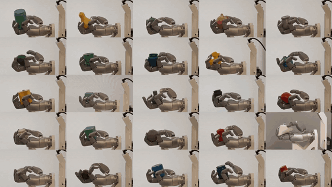
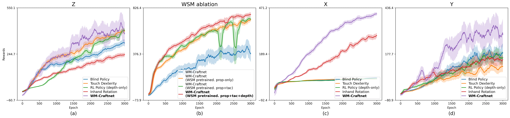
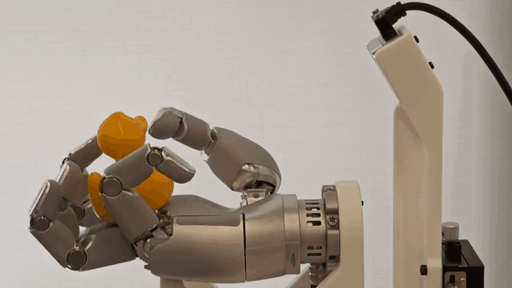

# WM-Craftnet: World Synesthesia Model for Generalizable and Robust Dexterous In-Hand Manipulation

**Jie Yin, Zeyuan Zhao, Xiaojing Tan, Yang Liu, Chiyu Wang, Xinyang Gu**

**Sharpa Robotics**

**CoRL 2026**


[](https://wmcraftnet.github.io)
[](https://arxiv.org/abs/2609.07002)
[](https://www.corl.org/)
[](LICENSE)
[](https://www.sharpa.com/pages/wave)
[](https://developer.nvidia.com/isaac-gym)

<p align="center">
  <a href="https://wmcraftnet.github.io">
    
  </a>
</p>

## Overview

WM-Craftnet learns a **World Synesthesia Model (WSM)** from proprioception, noisy wrist depth, tactile contact, and action history. Its action-conditioned recurrent state provides an asymmetric actor–critic policy with task-relevant geometry, contact, motion, and slip context. Instead of optimizing through imagined rollouts, WM-Craftnet uses the detached WSM state directly as a deployable representation and learns to reconstruct clean depth from noisy observations for sim-to-real transfer.

<p align="center">
  
</p>

## Highlights

- **Predictive visuotactile state:** fuses proprioception, depth, touch, and action history while denoising hand–object geometry.
- **Robust and generalizable control:** handles multiple objects, unseen geometries, pose shifts, drift, and external disturbances.
- **Reusable physical prior:** a WSM pretrained on nine z-axis objects initializes downstream learning over 49 objects.
- **Real-robot deployment:** transfers to the human-sized, five-finger, 22-DoF Sharpa Wave hand using deployable sensors.

## Method Overview

1. Encode proprioception, wrist depth, tactile contact, and the previous action.
2. Learn action-conditioned dynamics with a Dreamer-style recurrent state-space model, including clean-depth and reward supervision.
3. Feed the detached deterministic WSM state to the policy; reuse pretrained WSM weights for downstream object sets.

## Demos and Results

<p align="center">
  
</p>

- [▶ Project video gallery: real robot, multi-axis rotation, depth reconstruction, and tool use](https://wmcraftnet.github.io/#multi-object-rotation)
- [▶ Disturbance-recovery example (MP4)](docs/media/disturbance-recovery.mp4)
- [▶ WSM latent depth reconstruction](https://wmcraftnet.github.io/#depth-reconstruction)
- [▶ Robustness and unseen-object tests](https://wmcraftnet.github.io/#adjustment-gallery)

## Installation

### Requirements

- Linux with an NVIDIA GPU and a compatible CUDA driver
- Python 3.8
- PyTorch 2.1.0 with CUDA 11.8
- NVIDIA Isaac Gym Preview 4

Create the environment:

```bash
conda create -n wm-craftnet python=3.8
conda activate wm-craftnet

conda install pytorch=2.1.0 torchvision torchaudio pytorch-cuda=11.8 \
  -c pytorch -c nvidia
conda install -c fvcore -c iopath -c conda-forge fvcore iopath
conda install pytorch3d -c pytorch3d

pip install hydra-core gym numpy==1.22.2 tensorboardX tensorboard \
  wandb scipy imageio imageio-ffmpeg h5py trimesh rtree pillow ninja
```

Download [NVIDIA Isaac Gym Preview 4](https://developer.nvidia.com/isaac-gym), accept its license, and install it separately:

```bash
tar -xzvf IsaacGym_Preview_4_Package.tar.gz
cd isaacgym/python
pip install -e . --no-deps
```

See [`install.md`](install.md) for the repository's installation notes.

## Training

The provided entry points select the corresponding task configuration and accept additional Hydra overrides:

```bash
# z-axis rotation on nine objects
bash scripts/train_wm_craftnet_z.sh task.env.objSet=set_z

# x-axis rotation on four objects
bash scripts/train_wm_craftnet_x.sh task.env.objSet=set_x4

# y-axis rotation on nine tool-like objects
bash scripts/train_wm_craftnet_y.sh task.env.objSet=set_y

# z-axis downstream training on 49 objects from the nine-object WSM prior
bash scripts/train_wm_craftnet_z.sh \
  task.env.objSet=set49 \
  task.env.cameraPolicy.worldModel.resume_body_from=example_ckpt/wm_craftnet_set_z.pth
```

The official training setup uses `num_envs=1024` and `minibatch_size=4096`
(see [`isaacgymenvs/cfg/train/WMCraftnetPPO.yaml`](isaacgymenvs/cfg/train/WMCraftnetPPO.yaml)).
The entry scripts default to `256` environments and a `1024` PPO minibatch so
the WSM replay buffer fits on a 32 GiB host. If GPU memory or host RAM is
insufficient, reduce both together, for example:

```bash
NUM_ENVS=256 MINIBATCH_SIZE=1024 bash scripts/train_wm_craftnet_y.sh
```

On larger-memory machines, restore the original settings explicitly:

```bash
NUM_ENVS=1024 MINIBATCH_SIZE=4096 bash scripts/train_wm_craftnet_y.sh
```

Edit the device switches at the top of each training script when using different simulation, RL, or graphics GPUs. Training outputs are written under `runs/`.

### WSM prediction heads

The default configuration enables six optional heads—proprioception, clean
depth, object pose, tactile contact, critic value, and BPS object shape—plus
reward prediction. Configure them under `task.env.cameraPolicy.worldModel` in
[`WMCraftnetRotation.yaml`](isaacgymenvs/cfg/task/WMCraftnetRotation.yaml), or
override individual flags at launch:

```bash
# Keep only the proprioception and depth heads
bash scripts/train_wm_craftnet_z.sh \
  task.env.cameraPolicy.worldModel.wm_pose_pred=False \
  task.env.cameraPolicy.worldModel.wm_tac_pred=False \
  task.env.cameraPolicy.worldModel.wm_value_pred=False \
  task.env.cameraPolicy.worldModel.wm_obj_pred=False
```

Checkpoint and head configurations must match. The released `example_ckpt/`
weights use the legacy proprioception-plus-depth setup; test them with
`scripts/test_wm_craftnet.sh`. For full-head runs, use matching flags (see
`scripts/test_wm_craftnet_y.sh`).

## Testing

Released z-axis checkpoints:

- `example_ckpt/wm_craftnet_set_z.pth`: nine-object z-axis policy.
- `example_ckpt/wm_craftnet_set49.pth`: 49-object z-axis policy initialized from the reusable WSM prior.

Run interactive testing for the nine-object model:

```bash
CHECKPOINT=example_ckpt/wm_craftnet_set_z.pth \
bash scripts/test_wm_craftnet.sh
```

Run the 49-object model:

```bash
CHECKPOINT=example_ckpt/wm_craftnet_set49.pth \
TEST_OBJ_SET=set49 \
bash scripts/test_wm_craftnet.sh
```

The test script opens the viewer by default and accepts additional Hydra arguments after the script name. Use `HEADLESS=true` when a display is unavailable.

## Object Sets

- `set_z`: nine diverse objects for z-axis rotation and WSM pretraining.
- `set_x4`: four objects for contact-constrained x-axis rotation.
- `set_y`: nine elongated or tool-like objects for y-axis rotation.
- `set49`: 49 objects for downstream z-axis policy learning from the reusable nine-object WSM prior.

Object meshes, robot assets, and datasets may have terms independent of this repository. Consult [`THIRD_PARTY_NOTICES.md`](THIRD_PARTY_NOTICES.md) before redistribution.

## Real-Robot Deployment

Real-hardware examples are provided under [`deploy/`](deploy/). Use a separate
Python 3.10 environment for deployment; simulation and training use Python 3.8.

<p align="center">
  <a href="docs/media/real-robot-duck.mp4">
    
  </a>
</p>
<p align="center">
  <a href="docs/media/real-robot-duck.mp4">▶ Watch the real-robot duck rotation video (MP4)</a>
</p>

### Sharpa Wave SDK

Download the public Sharpa Wave SDK from the
[Sharpa download page](https://www.sharpa.com/pages/downloads) or the
[official GitHub releases](https://github.com/sharpa-robotics/sharpa-wave-sdk/releases).
For a standard x86-64 Ubuntu workstation, run the following commands from the
repository root to download the public non-CUDA SDK v5.0.9 and place its runtime
directly under `deploy/sharpa_sdk/`:

```bash
SDK_DEB=/tmp/sharpa-wave-sdk_5.0.9_amd64.deb
SDK_TMP=$(mktemp -d)

curl -fL \
  https://github.com/sharpa-robotics/sharpa-wave-sdk/releases/download/v5.0.9/sharpa-wave-sdk_5.0.9_amd64.deb \
  -o "$SDK_DEB"
echo "672c0b2e02f64c0db22760e8331f6e35e1fc9e7ef84363e81481e608a1278dfb  $SDK_DEB" \
  | sha256sum -c -
dpkg-deb -x "$SDK_DEB" "$SDK_TMP"

rm -rf deploy/sharpa_sdk/lib deploy/sharpa_sdk/python/sharpa
mkdir -p deploy/sharpa_sdk/python
cp -a "$SDK_TMP/opt/sharpa-wave-sdk/lib" deploy/sharpa_sdk/lib
cp -a "$SDK_TMP/opt/sharpa-wave-sdk/python/sharpa" deploy/sharpa_sdk/python/sharpa
cp "$SDK_TMP/opt/sharpa-wave-sdk/VERSION" deploy/sharpa_sdk/VERSION
cp "$SDK_TMP/opt/sharpa-wave-sdk/sdk-release-info.json" deploy/sharpa_sdk/sdk-release-info.json

rm -rf "$SDK_TMP" "$SDK_DEB"
```

The inference scripts load this repository-local SDK. The non-CUDA build
receives 30 Hz tactile inference results from the hand. The optional CUDA SDK
build requires CUDA 13.x and TensorRT 10.x.

### Run on the real robot

Configure `checkpoint`, camera settings, `no_actuation`, and `max_steps` in
`build_hardcoded_config()` inside
[`deploy/examples/wm_craftnet_infer.py`](deploy/examples/wm_craftnet_infer.py).
Then run from the repository root:

```bash
conda activate inhand_deploy310
python deploy/examples/wm_craftnet_infer.py
```

Before running on hardware, align the wrist depth camera with the simulation
setup as closely as possible. The policy expects the same field of view and
depth preprocessing as training, not just the same checkpoint.

| What to tune | Where to edit |
| --- | --- |
| Simulation reference camera pose on the hand (`pos`, `rot`) | [`isaacgymenvs/cfg/task/WMCraftnetRotation.yaml`](isaacgymenvs/cfg/task/WMCraftnetRotation.yaml) → `task.env.cameraPolicy.sensor` |
| Simulation camera resolution and approximate intrinsics (`width`, `height`, `fov`) | same block: `task.env.cameraPolicy.sensor` |
| Depth crop that defines the final policy input size | same file → `task.env.cameraPolicy.depth_preprocess.crop` (`top_px`, `bottom_px`, `left_px`, `right_px`) |
| RealSense stream resolution and frame rate | [`deploy/examples/wm_craftnet_infer.py`](deploy/examples/wm_craftnet_infer.py) → `build_hardcoded_config()` (`cam_width`, `cam_height`, `cam_fps`) |
| Checkpoint path and safe dry-run switches | same function (`checkpoint`, `no_actuation`, `max_steps`) |

Practical workflow:

1. Mount the physical depth camera to match the simulation pose in
   `cameraPolicy.sensor.pos` / `cameraPolicy.sensor.rot`.
2. Set the RealSense stream in `build_hardcoded_config()`; the runtime resizes
   depth to the training base size (`96 x 72`) before applying the crop from
   `depth_preprocess.crop`.
3. If the real view is shifted or cropped differently from simulation, adjust
   the crop margins in `depth_preprocess.crop` rather than changing the policy
   network input size.
4. Start with `no_actuation=True` and verify the depth preview before enabling
   actuation.

> [!CAUTION]
> Running a learned policy can cause immediate and unexpected robot motion. Before issuing any command, verify the robot identity and network connection, test the emergency stop, enforce joint and torque limits, remove people and obstacles from the workspace, and begin at reduced speed under direct supervision.

## Acknowledgements

WM-Craftnet builds on the following open-source projects. We thank their
authors for making their work available to the community:

- [Isaac Gym Environments (IsaacGymEnvs)](https://github.com/isaac-sim/IsaacGymEnvs) — simulation and RL training infrastructure
- [World Model-based Perception (WMP)](https://github.com/bytedance/WMP) — world-model-conditioned policy learning
- [Robot Synesthesia / in-hand rotation](https://github.com/YingYuan0414/in-hand-rotation) — dexterous in-hand manipulation task design
- [DreamerV3](https://github.com/danijar/dreamerv3) — recurrent state-space world model architecture
- [rl_games](https://github.com/Denys88/rl_games) — PPO training backend

See [`NOTICE`](NOTICE) and [`THIRD_PARTY_NOTICES.md`](THIRD_PARTY_NOTICES.md) for
license texts and attribution requirements.

## Citation

If you find WM-Craftnet useful, please cite:

```bibtex
@inproceedings{yin2026wmcraftnet,
  title     = {WM-Craftnet: World Synesthesia Model for Generalizable and Robust Dexterous In-Hand Manipulation},
  author    = {Yin, Jie and Zhao, Zeyuan and Tan, Xiaojing and Liu, Yang and Wang, Chiyu and Gu, Xinyang},
  booktitle = {Conference on Robot Learning (CoRL)},
  year      = {2026}
}
```

## License

Original WM-Craftnet code is released under the [Apache License, Version 2.0](LICENSE), except where a file or component carries a different notice. This license does not relicense third-party code, Isaac Gym, datasets, robot or object assets, SDKs, binaries, or pretrained materials. See [`NOTICE`](NOTICE) and [`THIRD_PARTY_NOTICES.md`](THIRD_PARTY_NOTICES.md) for details.
